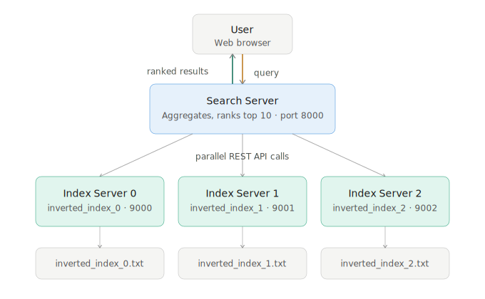
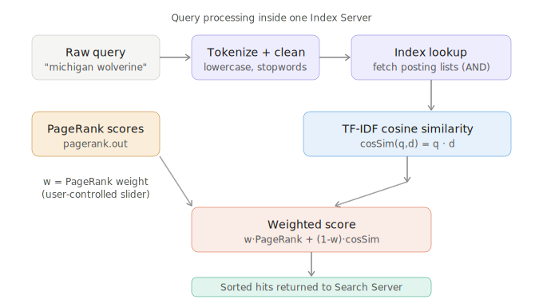
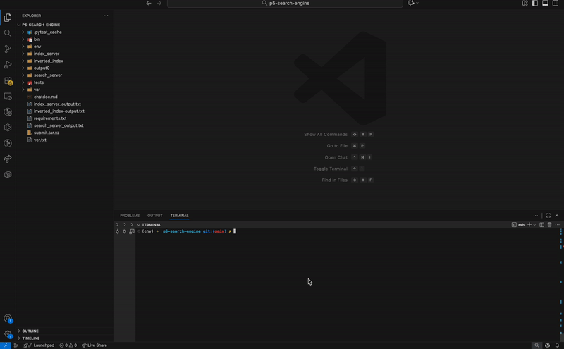
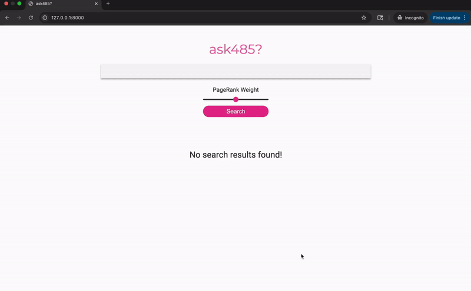

# ask485 — Distributed Search Engine

> A distributed, service-oriented search engine built on MapReduce indexing, TF-IDF ranking, and PageRank-weighted scoring.


---

## Table of Contents
- [Overview](#overview)
- [Features](#features)
- [Architecture](#architecture)
- [Quick Start](#quick-start)
- [Usage Examples](#usage-examples)
- [FAQ](#faq)
- [Accessibility](#accessibility)
- [Acknowledgements](#acknowledgements)

---

## Overview

**ask485** is a web-based search engine that allows users to query a document collection and receive ranked results through an interactive web interface. It is designed for developers and students interested in understanding how large-scale search systems are structured — including indexing, querying, ranking, and result aggregation across multiple services.

Rather than focusing on production deployment, this project emphasizes **system architecture**, **data flow**, and **search concepts** such as distributed indexing and PageRank-style ranking. It is well-suited for learning, demonstrations, and technical documentation.

---

## Features

- **Distributed Indexing** — Documents are processed and indexed across multiple index services using a MapReduce pipeline, enabling scalable and parallel search operations.
- **Query Aggregation** — User queries are sent to multiple index services simultaneously; partial results are merged and ranked before being returned.
- **TF-IDF + PageRank Scoring** — Documents are ranked using a weighted combination of cosine similarity (TF-IDF) and PageRank scores. Users can adjust the PageRank influence via a slider.
- **Interactive Search Interface** — A web-based UI allows users to submit queries and view ranked results in real time.
- **Service-Oriented Architecture** — The system is organized into clearly defined services (index servers and search server) that communicate through well-defined REST APIs.

---

## Architecture

ask485 uses a **three-tier service-oriented architecture**:

1. The **user** submits a query through the web browser.
2. The **Search Server** receives the query, fans it out to all Index Servers in parallel, and aggregates results.
3. Each **Index Server** searches its own segment of the inverted index and returns scored hits.
4. The Search Server merges all hits, applies final ranking, and returns the top 10 results.



**Ranking formula:**
Score(query, doc, w) = w × PageRank(doc) + (1 - w) × cosSim(query, doc)
Where `w` is the PageRank weight (0–1) set by the user, and `cosSim` is the TF-IDF cosine similarity between the query and document vectors.



---

## Quick Start

### Prerequisites

- Python 3.10+
- Flask (`pip install flask`)
- Virtual environment tool (`venv`)

### Installation

```bash
# 1. Clone the repository
git clone https://github.com/aakristath/search-engine-readme
cd search-engine-readme

# 2. Create and activate a virtual environment
python3 -m venv env
source env/bin/activate   # On Windows: env\Scripts\activate

# 3. Install all dependencies
pip install -r requirements.txt
pip install -e index_server
pip install -e search_server
```

### Running the System

**Step 1 — Build the search database** (extracts titles, URLs, summaries from crawled HTML):

```bash
./bin/searchdb
# Output: Created var/search.sqlite3
```

**Step 2 — Start the Index Servers** (3 segments, each on its own port):

```bash
./bin/index start
```

This launches three Flask index servers:

```bash
INDEX_PATH=index_server/index/inverted_index/inverted_index_0.txt flask --app index run --host 0.0.0.0 --port 9000
INDEX_PATH=index_server/index/inverted_index/inverted_index_1.txt flask --app index run --host 0.0.0.0 --port 9001
INDEX_PATH=index_server/index/inverted_index/inverted_index_2.txt flask --app index run --host 0.0.0.0 --port 9002
```

**Step 3 — Start the Search Server:**

```bash
./bin/search start
```

**Step 4 — Open the interface:**

Go to [http://localhost:8000](http://localhost:8000) in your browser.

### Stopping the System

```bash
./bin/search stop
./bin/index stop
```

---

## Usage Examples

### Running the System (Terminal Demo)



This demo shows activating the virtual environment and starting the Flask-based search server from the terminal. Once running, the service listens for incoming search requests from the web interface.

### Search Interface Demo



This demo shows a user submitting a query through the web interface and receiving ranked search results. The **PageRank weight slider** adjusts the influence of link-based ranking on the final output — slide left to weight TF-IDF more heavily, slide right to weight PageRank more.

---

## FAQ

**Is this a production-ready search engine?**  
No. ask485 is intended for educational and demonstration purposes, focusing on architecture and data flow rather than production deployment.

**What ranking methods are supported?**  
The system combines TF-IDF cosine similarity with PageRank-style weighting. The formula is:
`Score = w × PageRank(doc) + (1 - w) × cosSim(query, doc)`

**Why are there 3 index servers?**  
The inverted index is segmented into 3 files (partitioned by `doc_id % 3`). Each index server loads one segment, enabling parallel query processing.

**Can this system scale to large datasets?**  
The architecture demonstrates scalable concepts such as distributed indexing and query aggregation. Real-world scaling would require additional optimizations like index replication, load balancing, and caching.

**What happens if I stop one index server?**  
Results will be incomplete — only 2 of 3 index segments will be searched. Run `./bin/index status` to check if all 3 servers are running.

---

## Accessibility

All images and GIFs in this README include descriptive alt text to support screen readers.  
The web interface uses high-contrast colors and large input elements to improve readability and usability.

---

## Acknowledgements

This project was built as part of EECS 485 (Web Systems) at the University of Michigan. It is inspired by concepts from information retrieval and distributed systems, including MapReduce-based index construction, TF-IDF scoring, PageRank-based ranking, and service-oriented architectures.

Original project specification by Andrew DeOrio (awdeorio@umich.edu).
